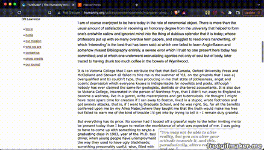

# Type2Learn

Ever happened that while reading a long article, you cannot concentrate and read the same line again and again? Try this extension now! Read the text by typing it on the webpage itself. Monitor your speed, errors you make, and accuracy in real-time.

## Installation

Type2Learn can be found on the Chrome store [here](https://chrome.google.com/webstore/detail/type2learn/fhaenfmnpmhafnbamailokcjjbpmehig)

## Demo

## Steps to use the extension

1) Select a paragraph by clicking on it or selecting any word from it
2) Click on the extension icon in the toolbar. A popup will appear.
3) Click on the button - Prepare Text. You should see the first letter of the paragraph highlighted.
4) Start typing from the beginning of the selected paragraph.

## License

[MIT](https://choosealicense.com/licenses/mit/)
